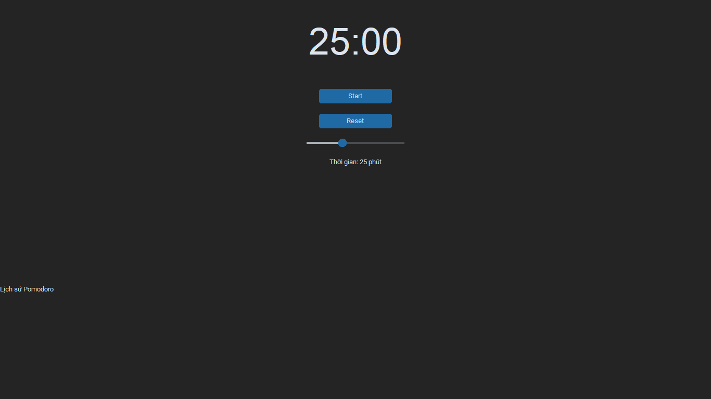

# ⏱️ My Pomodoro — Minimalist Focus Timer

> A productivity-focused Pomodoro timer built with Python and Tkinter — created to help students, creators, and developers stay focused and mindful

 <!-- Replace with your screenshot path -->

---

## 🎯 About

**My Pomodoro** is a minimalist, full-screen Pomodoro timer tailored for deep work and distraction-free study. Created by **Võ Tuấn Kiệt**, a passionate student and productivity enthusiast, this app supports a clean UI/UX design, gentle sound notifications, and personalized rest suggestions — all while keeping your focus at the core.

Whether you're studying, coding, or creating — My Pomodoro helps you structure your time for optimal performance.

---

## 🌟 Key Features

- 🕒 Classic Pomodoro cycle (25/5/15 mins configurable)
- 🔕 No background sounds for complete silence while working
- 🎵 Subtle bell sound at end of each Pomodoro
- 💡 Smart rest suggestions after each cycle (e.g., stretch your shoulders)
- 🌙 Minimalist full-screen mode for ultimate focus (ESC to exit)
- 🕘 Pomodoro history tracking (daily session count)
- 🌓 Optional dark theme & ultra-minimal interface

---

## 💻 Installation

### 🔧 Build from source

```bash
git clone https://github.com/yourusername/my-pomodoro.git
cd my-pomodoro
python main.py
````

### 🪄 Build `.exe` (Windows)

Requires [PyInstaller](https://pyinstaller.org/):

```bash
pip install pyinstaller
pyinstaller --onefile --noconsole main.py
```

The `.exe` file will be created in the `dist/` folder.

---

## 📦 Folder Structure

```
my-pomodoro/
├── assets/              # Optional images or sounds
├── main.py              # Main app logic (Tkinter UI + Pomodoro logic)
├── pomodoro.py          # Timer class logic
├── themes.py            # Dark/light theme support
├── utils.py             # Helper functions (history, sound, etc.)
├── README.md
```

---

## 📈 Future Ideas

* 🔁 Customizable Pomodoro lengths
* ☁️ Sync with Google Calendar / Notion
* 🌍 Multi-language support (Vietnamese, English, Japanese...)
* 📱 Mobile version (Kivy or Flutter)

---

## 👤 Author

**Võ Tuấn Kiệt** — Python developer, UI/UX designer, and student passionate about AI, embedded systems, and productivity tools.

📍 Based in Vietnam
🔗 [LinkedIn](https://www.linkedin.com/in/ki%E1%BB%87t-v%C3%B5-tu%E1%BA%A5n-ab2001346/)

> Building tools that make focus a habit.

---

## 🤝 Contributing

Open to feedback, pull requests, and feature suggestions!
Feel free to fork or clone this repo and create your own custom version 🧠

---

## 📄 License

This project is open-source and available under the [MIT License](./LICENSE)

```
